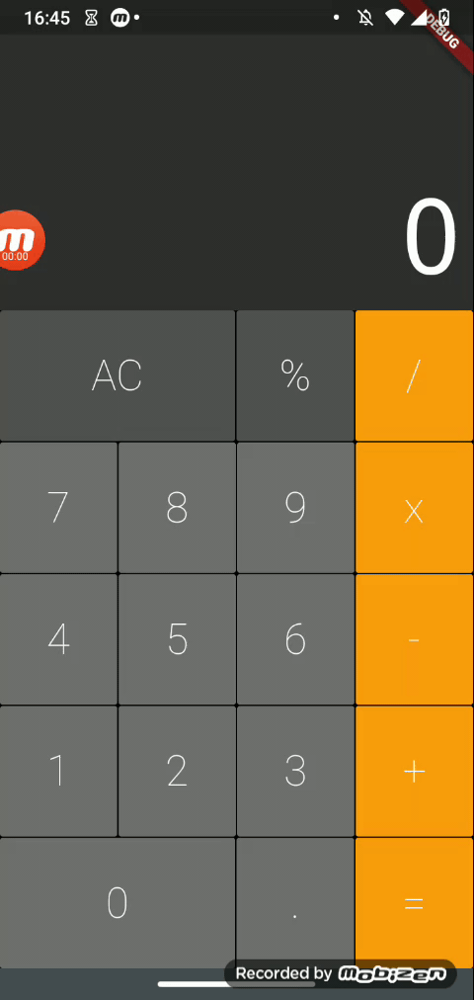

# Flutter Calculator ➕

<h1 align="center">
  
</h1>

## 🚀 About

This is a calculator app, bult with flutter and Dart. It's simple, but hope you like it!

### 📋 Precondition

This project needs Flutter. If you do not have it installed, just follow [THIS](https://flutter.dev/docs/get-started/install) link and install.

### 👨‍💻 How to Setup

```bash
  # Clone the project
  $ git clone https://github.com/Levis44/Flutter-Calculator.git
```

To execute the project, just run this code this commands:

```sh
  $ cd Flutter-Calculator # acces the folder
  $ cd calculator # acces the folder
  $ npm init -y # inicialize the package.json
  $ flutter run --no-sound-null-safety # run app
```

## 🛠️ Tools

- [Flutter](https://flutter.dev/docs/get-started/install)
- [Dart](https://dart.dev/guides)

## 📝 License

This project is under the MIT license. See the file [LICENSE.md](LICENSE) for more details.

---

<p align="center">Done by Levi Bernardelli Ciarrocchi ✌🏼</p>

